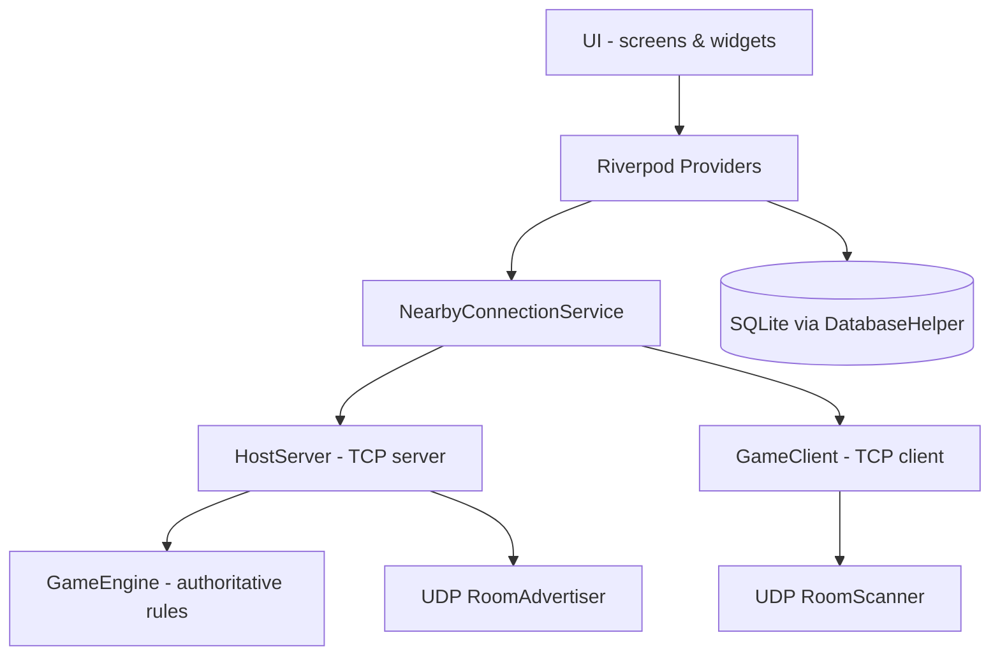
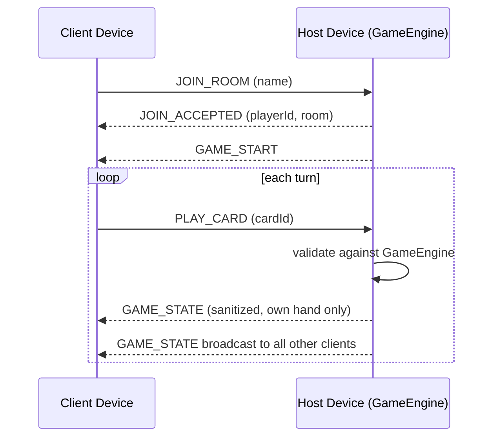
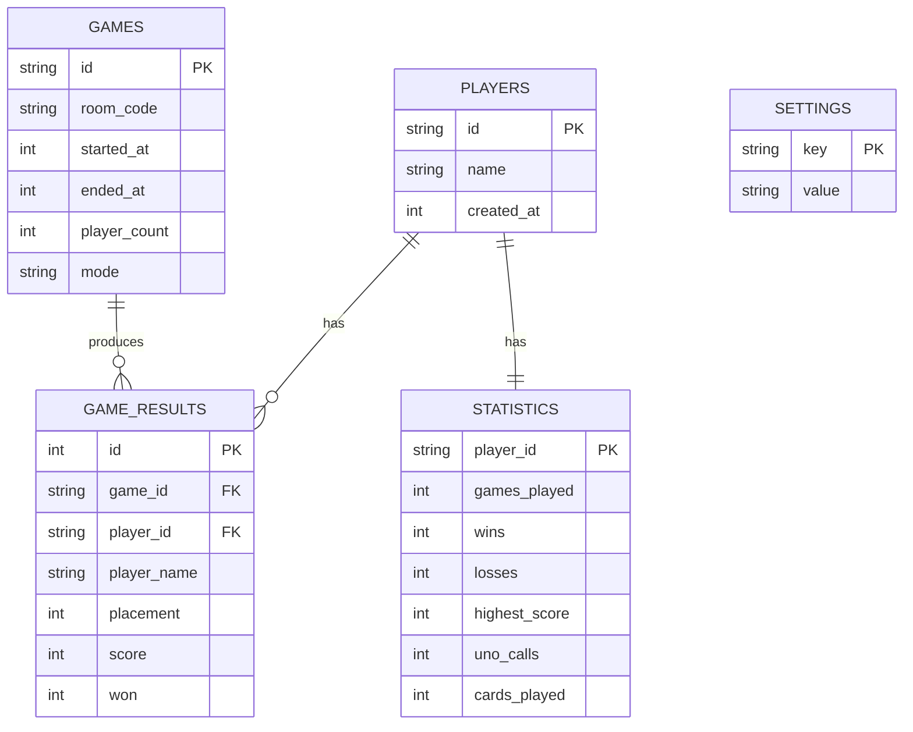
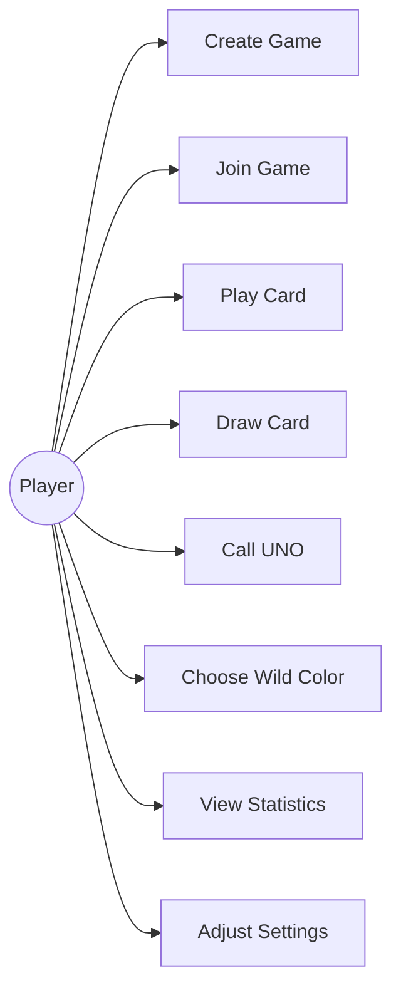
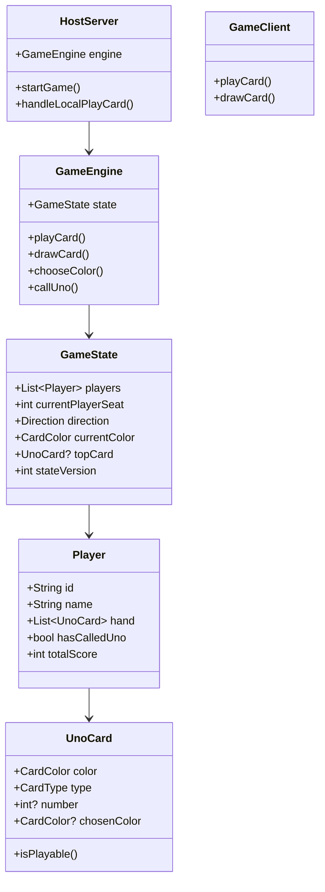
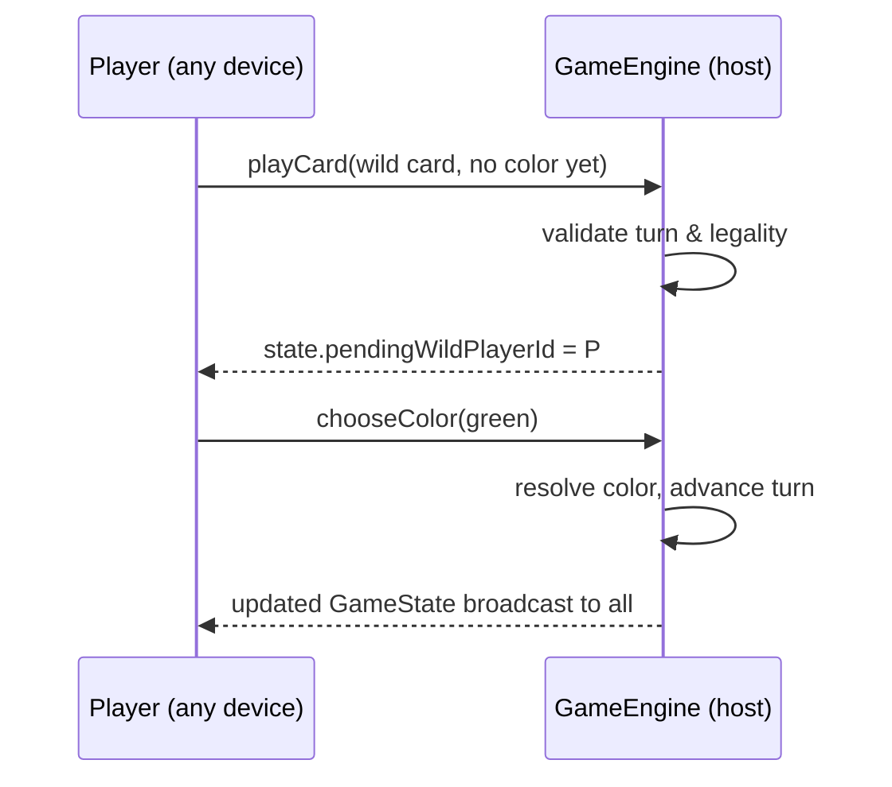
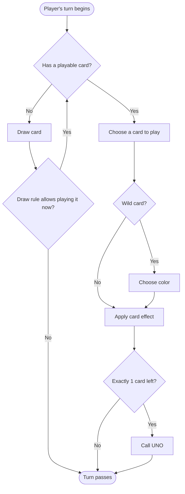

# UNO Nearby — Project Report

## 1. Abstract

UNO Nearby is an offline, real-time multiplayer card game for Android that lets 2–4
players on the same local network play a UNO-style game with no internet connection, no
cloud backend, and no third-party account. It demonstrates a host-authoritative
peer-to-peer architecture built entirely on Flutter's standard socket APIs, avoiding
fragile platform-specific peer-to-peer plugins.

## 2. Introduction

Most digital card games assume constant internet connectivity and a managed backend.
UNO Nearby targets the opposite case: people in the same room who want to play together
without Wi-Fi/data being available at all — a classroom, a flight, a basement with no
signal. The only requirement is that devices can reach each other on a local network
(shared Wi-Fi or one device's hotspot).

## 3. Problem Statement

Build a UNO-style card game playable by 2–4 nearby Android devices with zero reliance on
internet access or cloud infrastructure, while still providing real multiplayer
synchronization (not turn-passing on one device, and not a fake/simulated multiplayer
mode).

## 4. Existing System

Existing UNO-style apps (official UNO!, UNO Friends, etc.) require an internet
connection and a central server or cloud matchmaking service, and typically require an
account. Purely local/offline "pass and play" apps exist but require sharing a single
device, defeating the purpose of each player having their own hand privately.

## 5. Proposed System

A host-authoritative local-network game: one device creates a room and becomes the
sole source of truth for game state; other devices connect over the same Wi-Fi/hotspot
and exchange only validated action requests and sanitized state snapshots with the host.
No player device — including the host's own UI — is trusted to mutate shared game state
directly; all mutation happens inside a single `GameEngine` instance living on the host.

## 6. Objectives

- Real 2–4 player multiplayer with no internet dependency.
- Full, correctly-implemented UNO rule set including all action and wild cards.
- Host-authoritative validation preventing any client from cheating.
- Local persistence of match history and statistics.
- A polished, native-feeling Material 3 mobile UI.
- An offline AI opponent mode for solo play.

## 7. Scope

In scope: Android, 2–4 players, classic UNO ruleset with configurable UNO-penalty and
draw-rule variants, local SQLite statistics, local AI opponents, reconnection within a
grace window. Out of scope for this version: iOS, host migration on host disconnect,
tournament-legal Wild Draw Four challenge enforcement (implemented as the common "trust"
variant instead), voice/video chat, online/cloud matchmaking.

## 8. Requirements

**Functional**: create/join room, discover nearby rooms, deal and validate cards, enforce
turn order and special-card effects, detect round/match end and compute scores, persist
statistics, support an AI-only or mixed human/AI match.

**Non-functional**: must run with airplane mode on (except local Wi-Fi/hotspot); must not
silently desync client and host state (state-version guarding); must not crash on
malformed network input, denied permissions, or a dropped connection.

## 9. Technology Stack

Flutter + Dart, Material 3, Riverpod (state management), `dart:io` `Socket`/`ServerSocket`
and `RawDatagramSocket` (networking — no third-party P2P plugin), sqflite (local
persistence), permission_handler, network_info_plus.

## 10. System Architecture

## 11. Networking Architecture

Discovery runs in parallel over UDP: the host broadcasts a `ROOM_ADVERTISEMENT` payload
every 1.5s on port 58911; scanning clients listen on the same port and populate the
"Nearby Games" list in real time.

## 12. Game Architecture

`Deck` builds and shuffles the 108-card deck. `GameRules` holds pure, stateless legality
and turn-order functions. `GameEngine` is the only component allowed to mutate a live
`GameState`; every public method (`playCard`, `drawCard`, `chooseColor`, `callUno`)
validates the request and returns an `EngineResult` with either the new state or a
rejection reason. `AiPlayer` calls the exact same `GameEngine` methods a human or remote
client would — it has no special access.

## 13. Database Design

## 14. UML Use Case

## 15. UML Class Diagram

## 16. Sequence Diagram — Playing a Wild Card

## 17. Activity Diagram — A Single Turn

## 18. Implementation

See `README.md` for the concrete module layout. Key implementation decisions:

- **Host authority everywhere, including the host's own UI** — the host device's local
  human player calls the identical `GameEngine` methods a remote client's request would
  trigger, via `HostServer.handleLocal*`, so there is never a "trusted" code path that
  skips validation.
- **State versioning** — every `GameState` carries a monotonically increasing
  `stateVersion`; clients discard any incoming snapshot that isn't strictly newer,
  preventing an out-of-order network packet from rolling the UI backward.
- **Sequence numbers on every message** — `NetworkMessage.sequence` lets the host reject
  replayed or out-of-order client messages.
- **Sanitized client views** — `GameState.toClientJson(playerId)` never serializes another
  player's hand, only their card count.

## 19. Testing

Unit tests cover deck composition (`test/deck_test.dart`), rules legality and turn math
(`test/game_rules_test.dart`), the engine's validation and state transitions for every
card type including Skip/Reverse/Draw Two/Wild/Wild Draw Four, the UNO penalty, and win
scoring (`test/game_engine_test.dart`), and JSON serialization round-trips plus
client-state sanitization (`test/serialization_test.dart`). These were authored to be run
with `flutter test` once a Flutter SDK is available (see README — that could not be
executed in the authoring environment). Networking integration tests (multi-socket join/
leave/reconnect against a real `HostServer`) and widget tests for each screen are natural
next additions once the project is running in a normal Flutter dev environment, using
`test/game_engine_test.dart`'s deterministic `initialDrawPile` pattern as a model for
building further fixtures.

## 20. Results

The engine's rule logic (legality, turn order, action-card effects, scoring, UNO penalty)
is fully implemented and exercised by unit tests. The networking layer implements a
complete host/client protocol over local sockets with discovery, reconnection, and replay
protection. The nine required screens are implemented and wired to live state. What
remains is environment-dependent verification (`flutter analyze`/`flutter test`/`flutter
build apk`) that requires an actual Flutter toolchain, plus the smaller polish items
listed under Limitations below and in the README.

## 21. Limitations

- No host-migration on host disconnect (explicitly out of scope per the design brief
  rather than faked).
- No audio assets or playback wiring yet (settings toggles exist; no sound files bundled).
- No custom app icon/splash bitmap assets bundled (paths are wired, files are not).
- Not yet compiled/run against a real Flutter SDK in this environment — first
  `flutter analyze` pass should be treated as the real correctness gate.

## 22. Future Enhancements

- Host migration via a simple "next-lowest-seat becomes host" election, with the new
  host's engine seeded from the last broadcast state.
- Wi-Fi Direct as an additional discovery transport for networks that block UDP broadcast.
- Voice chat or simple emoji reactions between players.
- Tournament-legal Wild Draw Four challenge flow (currently the trust variant).
- iOS support (the engine/networking are already platform-agnostic Dart; only
  platform-channel permission code is Android-specific).

## 23. Conclusion

UNO Nearby shows that a fully offline, host-authoritative local-multiplayer card game is
practical on stock Flutter APIs — no proprietary peer-to-peer plugin, cloud database, or
internet connection required. The architecture cleanly separates rules (`GameEngine`),
transport (`networking/`), and presentation (`screens/`, `widgets/`), which should make
the remaining polish (audio, icons, host migration) straightforward additions rather than
rewrites.
